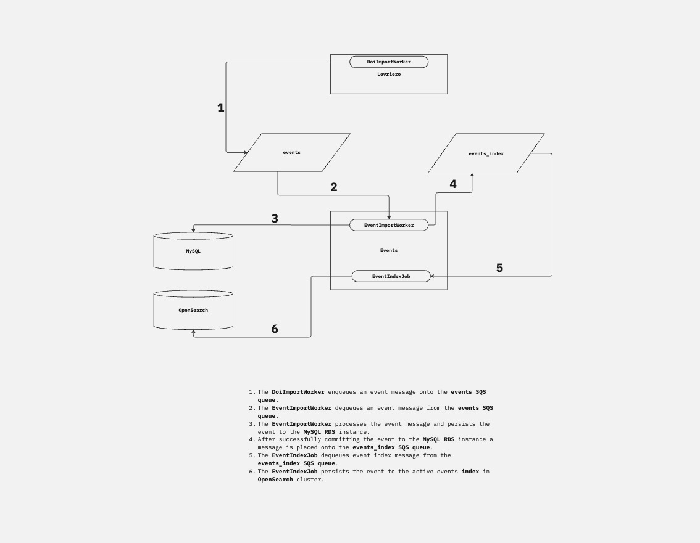

# DataCite Events Service

This is the code repository for the DataCite Events REST API.

### Process Flow Diagram

### Adding new Shoryuken workers

1. Add workers to the app/workers directory
2. Ensure you set the shoryuken_options e.g. `shoryuken_options queue: -> { "#{ENV['RAILS_ENV']}\_events" }, auto_delete: true`
3. Queues use environment prefixes. The prefix is set with the environment variable RAILS_ENV locally.

### Starting the Shoryuken workers

1. Workers are disabled in development by default.
2. The environment variable DISABLE_QUEUE_WORKER is used in development to switch the worker on or off when you start the container.
3. The DISABLE_QUEUE_WORKER is set to nil by defalt in the docker-compose.yml i.e. DISABLE_QUEUE_WORKER=
4. If you want to start workers by default when the container spins up set DISABLE_QUEUE_WORKER to a truthy value i.e. 1, TRUE, true, foobar
5. Alternatively you can start the workers manually by bashing into the events_api container and running `bundle exec shoryuken -R -C config/shoryuken.yml`
